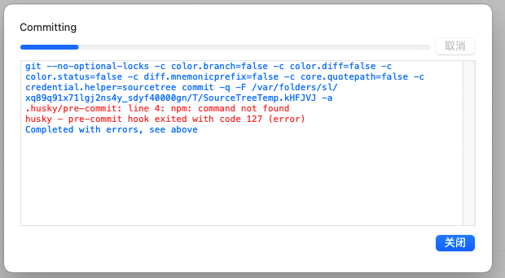
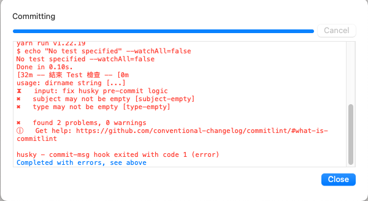

# react-vite-admin-template

這是一個基於 Vite 的 React 後台模板，套裝內容包含：

- TypeScript 支援
- Casl 權限檢查
- 登入、路由跳轉、頁面權限驗證
- 富含 ESLint + StyleLint + prettier 的 Coding Style
- 使用 Husky 對 Git Commit 格式進行檢測
- Pre-commit 前進行整份專案的 Coding Style 檢測以及執行 Test
- Ant-design + tailwindCSS UI Library 支持

> 本專案雖沒有測試案例，但歡迎各位 Clone 後自行添加！

**簡單說如果你需要一個 React 的後台，同時希望有權限驗證，也希望有現成的 UI 可以直接使用，專案又希望有一些 Coding Style 好日後維護，就是它了！**

## 運作環境
* Chrome v49+ or Firefox v45+ or Safari v9+
* 一台筆電 或 桌電(不建議使用手機)
* 一顆炙熱的寫 Code ❤️
* 至少有充足的睡眠(8/hr+)
* 至少保證自己吃過早點 或 晚餐(3餐+)
* 沒有喝酒的情況下

## 建議環境
* NPM v6+
* node v16+
* nvm v0.35.0

---

## 重點使用套件

- [vite](https://cn.vitejs.dev/guide/) - Vite（法語意為 "快速的"，發音 /vit/，發音同 "veet"）是一種新型前端構建工具，能夠顯著提升前端開發體驗。它主要由兩部分組成：
- [react-router-dom](https://reactrouter.com/docs/en/v6/getting-started/overview) - 路由套件
- [antd](https://ant.design/index-cn) - UI Library, 前端 UI 組件庫
- [sass](https://github.com/sass/sass) - 為了使用 scss 在 React css Module 上
- [clsx](https://github.com/lukeed/clsx) - 方便在 className 上同時使用字串及變數
- [use-react-router-breadcrumbs](https://github.com/icd2k3/use-react-router-breadcrumbs) - 快速抓取麵包屑套件
- [tailwindcss](https://tailwindcss.com/) - A utility-first CSS framework, 前端 CSS 框架
- [react-redux](https://redux.js.org/) - 狀態管理工具，類似 VueX

---

## 關於路由

路由使用 **react router dom v6** 版本，官方有幾種方式可以設定畫面渲染，本專案使用 [createBrowserRouter()](https://reactrouter.com/en/main/routers/create-browser-router) 方式，非 `JSX` 直接包裹 `<Route>` 方式。

專案的思考流程為 **渲染畫面邏輯** 與 **菜單顯示邏輯** 分別處理，故設定檔會分開，另外專案使用 [CASL v6](https://casl.js.org/v6/en) 來做權限控管，如果沒有正確塞入權限判斷 **Key** 值將會無法正常渲染畫面，欲新增新頁面請按照以下步驟：

1. 新增頁面 **component** 至 **pages** 資料夾
2. 至 `src/router/index.tsx` > `router()` > `createBrowserRouter()` 陣列裡新增預新加的頁面 **路由** 及 **元件位置**，該設定會讓元件被渲染到畫面上
  - 其中有 **子層(children)** 的話，父層可依情況包裹 **element component**，但相對的請記得最後要到 casl 權限新增該頁面權限，否則子頁面將無法渲染
  - `LazyLoad()` 內有透過 **Casl** 檢查的邏輯代碼，如果沒有權限將會被轉導至 **403** 頁面
  - **React router dom v6** 提供了一些好用的用法，例如 `loader()`，類似於 **vue** 的 `beforeRouterEntry()`，有興趣可以帶入設置，專案有吃到該設定
3. 至 `/src/router/menu/index.tsx` 新增預新加的頁面相關測定到 `menuList()` 裡，該元件掌管的是菜單的渲染，即使胡亂新增，如果沒有 **Casl** 權限或者相對應的畫面渲染(第一二點步驟)，就無法看到該菜單選項
4. 讓前端可以拿到 **Permission**，格式如 `/src/utils/mocks/permission.json` 內容。
5. (可選擇性設置)至 `/src/utils/configs/menuPermissions.ts` 設置剛剛新增頁面的 **Key**，方便日後有權限管理頁面，可以清楚知道頁面是哪個 **Key**。

> 專案秉持的思路為：
> 1. 前端無秘密，故畫面全渲染
> 2. 透過 CASL 權限套件來判斷是否該讓使用者在菜單上看見該選項
> 3. 進入頁面也會包裹一層 Lazy，透過類似 Middleware 的仲介層，可以阻擋掉沒有權限的操作，轉而導至 403 頁面
> 4. 菜單項目只會對沒有 children 的項目判斷是否有權限，最後才會判斷每一個項目是否有 children，如果 children 為空就不渲染該項目
> 5. 如果想要透過一個 key 判斷讓整個菜單包含子項目一起做權限控管，請修改 `/src/pages/home/components/Menu/index.tsx` 內的邏輯
> 6. 權限及頁面渲染重點在於 Key，請每一個頁面或者設定的 Key 一定要能對上

---

## Coding Style

本專案使用 **Husky** 跑 **Coding Style** 檢測，如果習慣使用 **Command Line** 的夥伴可以使用 `git cz` 或者直接 `git add` + `git commit`，如果格式不符合就會發生錯誤。

如果使用 **Sourcetree** 的夥伴請先使用 `where npx` 尋找你有沒有安裝該套件，如果沒有請安裝，如果有找到請依照下列步驟：

1. 終端機輸入 `where npx`

2. 出現 `/Users/rex/.nvm/versions/node/v16.15.1/bin/npx` (每個人路徑不同)

3. 終端機輸入 `touch ~/.huskyrc`

4. 終端機輸入 `echo 'export PATH="/Users/rex/.nvm/versions/node/v16.15.1/bin/:$PATH"' >> ~/.huskyrc`

5. 再次執行，這時候因為 **sourcetree** 認得 **npx** 及 **npm** 就不會出現 `command not found`

如果成功檢測格式不符合就會出現以下圖片內容：

> 如果還有出現 `command not found` 可以看一下缺少什麼 **command** 沒有找的的，可以再補上

### ESLint 相關

* 基本採用 Airbnb Rule
* 單引號
* 需忽略不檢查的檔案可以新增到 `.eslintignore`
* 更多檢查條件可參閱 `.eslintrc.cjs`

### Prettire Style 相關

* Tab 排版以兩格為主
* 需忽略不檢查的檔案可以新增到 `.prettierignore`

**如果想要儲存後自動修正排版，可使用 VSCode 並在專案目錄下新增 `.vscode/settings.json`，如下圖(目前僅限 JavaScript, 欲自動修正其他檔案詳細可修改 eslint.validate) - 僅限使用 VSCode**

* 透過 styleLint 可提前檢測不符合規範的 CSS Style
* 使用 `yarn lint:style:fix` 可自動修正排版(如果有設定 `settings.json` 即可不需要手動修正排版，儲存即修正)

### Pre-commit 檢測工具

- [husky](https://github.com/typicode/husky) - 透過 husky 可以在不同的 git hook 時期(例如 Pre-commit)執行不同動作, 詳情可查看 `.huskyrc.json`
- [lint-staged](https://github.com/okonet/lint-staged) - 自動檢查/修復排版，自動檢查/修復程式碼(搭配 ESLint 的條件), 詳情可查看 `.lintstagedrc.json`

### Commitlint

專案對於 Git Commit 設置一定的格式才能允許推送。

`type(scope): subject`

- type 僅接受 `commitlint.config.cjs` 裡 `type` 的宣告
- scope 為修改影響範圍，可選填，如不填寫最後送出格式為 `type: subject`
- subject 為簡短的修改說明

建議推送時使用 `git cz`，可以使用預先儲存的模板。

### i18n

翻譯請存於 `@/i18n/langs/` 底下，請依照不同語系分類。

- 翻譯有大小寫問題字首一律大寫，其他情況在程式碼內使用 **CSS** 或 **JS** 改變大小寫，保持 **i18n** 一致。

### Icon

**Icon** 主要使用 **Ant Design** 為主，如果 **Ant Design** 的沒有找到，可以使用 **Font-awesome**，本專案使用方式為 **CDN**，直接使用 `<i class="fa-brands fa-react"></i>` 即可引入。

### 備註

- ESLint 及 Prettier 有些設定會衝突，如有改動請盡量讓兩邊的設定一樣，例如 tabWidth 及 With 這種設定，如果不一樣可能會造成奇怪的錯誤

---

## 環境安裝說明

1. yarn install

2. 打開 /public/env.json 編輯 API_ROUTER 變數，此為 API 路徑

3. yarn dev / yarn build

4. 打開 Browser